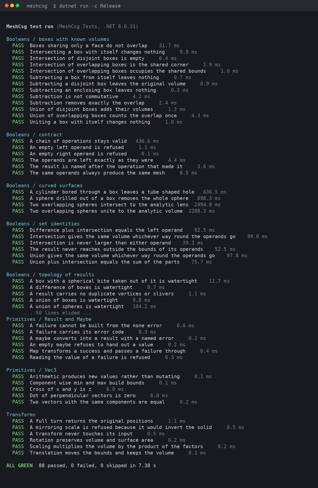
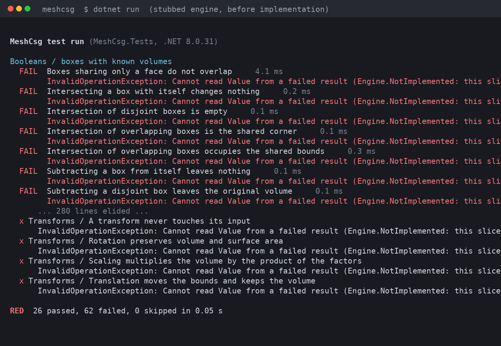
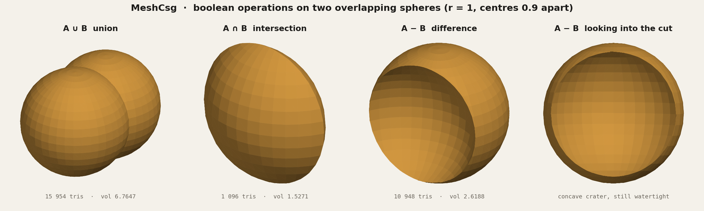
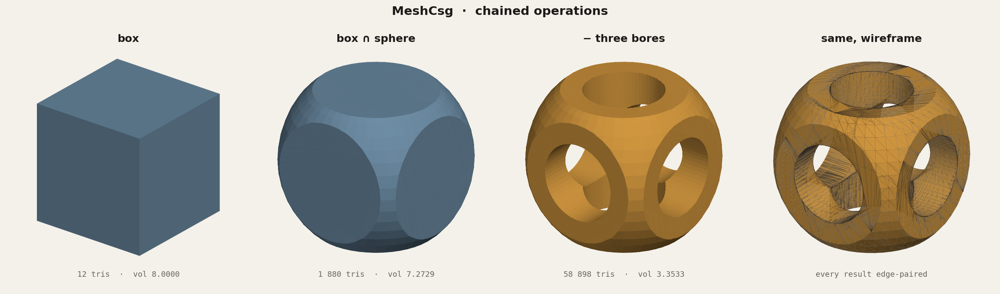
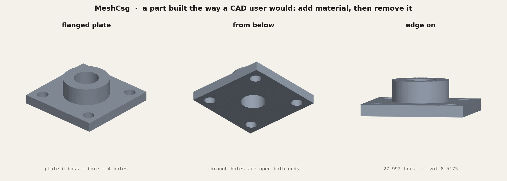

# GeometryEngine

A 3D mesh geometry library in C#, built to replace the MeshLib backend of
[nsmela/Fabolus](https://github.com/nsmela/Fabolus): booleans, offsets, decimation and repair,
spatial queries, planar polygons, decals, and mesh files. `net10.0`.

Booleans run on the native [Manifold](https://github.com/elalish/manifold) kernel, with the
managed BSP kernel described below as the fallback. Offsets and batched distance queries run on a
small libigl-backed native library (`native/`), with a managed BVH as the fallback. Native
binaries ship for win-x64; elsewhere everything still works on the managed paths. Planar work uses
Clipper2 and NetTopologySuite. See `THIRD-PARTY-NOTICES.md`.

A chain of booleans can be described as a value and evaluated in one native pass, so each mesh is
read by the kernel once and only the final solid is written out:

```csharp
var mould = engine.Booleans.Evaluate(Solid.Of(block).Subtract(bolus).Union(lug).Intersect(envelope));
```

See [`docs/boolean-query.md`](docs/boolean-query.md) for the design and measurements.

**192 tests, all green.** Fabolus's own suite (238 tests) passes against it through the thin
adapter in `Fabolus.Core/Geometry/Engine`.

### Beyond booleans

```
GeometryEngine
  Modifiers/             Offset, DoubleOffset (level set over a signed distance field),
                         Decimate (quadric edge collapse), Repair, RepairSelfIntersections
  Spatial/               ISpatialIndex: raycast, closest point, signed distance, batches
  Polygons/              outline and hull of a shadow, offset, buffer, union, extrude, triangulate
  Decals/                outline prisms laid onto curved surfaces
  Generators/            + tubes, arcs, path resampling, draped paths
  Evaluators/            + vertex normals, self-intersection count
  MeshIO/                STL, OBJ, OFF, PLY, and 3MF packages with a reference mesh and metadata
  Internal/Spatial/      managed BVH, triangle-triangle test
  Internal/Planar/       ear clipping with Delaunay flips, curve resampling
  Internal/Native/       Manifold binding, libigl distance field binding
native/                  geometryengine_native: libigl distance field (CMake)
```

The original boolean-kernel write-up follows.

---

## 1. The plan

### What it has to do

Three operations on closed triangle meshes — union, difference, intersection —
returning results that are themselves closed, so they can be fed straight back in.
That last property is what makes a CSG kernel useful and what most naive
implementations get wrong.

### Architecture

```
GeometryEngine.Core      contracts and value types; knows no algorithm
  Common/                Error, Result<T>, Maybe<T>
  Geometry/Primitives/   Vec3, Direction, Plane, Tolerance
  Geometry/              IMesh, ImmutableMesh, IGeometryEngine and friends

GeometryEngine           the implementation
  Booleans/              UnionSlice, SubtractSlice, IntersectSlice
  Generators/            box, sphere, cylinder
  Evaluators/            statistics, topology, components
  Transforms/            translate, scale, rotate
  MeshIO/                binary STL
  Internal/Csg/          BSP kernel: CsgPolygon, BspNode, CsgKernel, MeshHealer

GeometryEngine.Testing   a small test framework (see note below)
GeometryEngine.Tests     88 tests
GeometryEngine.Showcase  builds the models rendered in the figures
```

### Algorithm

Binary space partitioning, in the Thibault–Naylor formulation. Each solid becomes
a BSP tree; the two trees are clipped against one another, complemented where the
set algebra calls for it, and merged. Union is the base case and the other two are
De Morgan rewrites of it:

```
A ∪ B  =  merge(clip(A,B), clip(B,A) with coincident faces dropped)
A − B  =  ¬(¬A ∪ B)
A ∩ B  =  ¬(¬A ∪ ¬B)
```

Two departures from the textbook version, both of which earned their place:

**Divider selection.** Taking the first polygon's plane degenerates into a linked
list on structured input — a lathe-ordered sphere is the worst case. `BspNode`
samples eight candidate planes by index and picks the one that splits fewest
polygons and balances best. Sampling *by index* rather than at random keeps the
result reproducible, which is what the determinism test checks.

**Crack repair.** A BSP splits a polygon only along the planes it happens to meet
on its way down the tree. A neighbour may take a different path and be left
unsplit, so a T-vertex appears in the middle of its edge. That is not a hole
mathematically, but it breaks edge pairing and every downstream consumer — volume
integration, slicing for print — treats it as one. `MeshHealer` welds coincident
vertices, then re-triangulates any triangle with vertices sitting on its edges.
The augmented outline is still convex, but a fan from a corner would produce
slivers along that corner's own edges, so the fan starts from the centroid.

This is the part that makes the watertightness tests pass. Without it, results are
visually fine and topologically broken.

### Design guides

**Immutability.** `Vec3` is a `readonly record struct` because its default value
(the zero vector) is legal. `Direction` and `Plane` are sealed *records*, not
structs, precisely because a struct would have a zero-length default and a
zero-length normal is an illegal state. Both have private constructors and smart
factories returning `Maybe<T>`. `BspNode` is immutable too: `Insert`, `Inverted`
and `ClippedTo` return new trees, which is what lets the operations above read as
a sequence of values rather than in-place mutation.

The line I drew: immutability is a property of what a caller can *observe*.
Inside a private factory, `MeshBuilder` and the welder are ordinary mutable
accumulators that never escape. A vow of abstinence there would buy nothing.

**No nulls, no exceptions for control flow.** `Result<T>` for failure, `Maybe<T>`
for legal absence, `Error` records with codes rather than strings. `ImmutableMesh.Create`
rejects ragged index arrays, out-of-range indices and non-finite vertices, so an
invalid mesh cannot exist.

**Vertical slices.** Each feature folder owns its requests, handlers and errors.
The `IBooleans` facade holds three handlers and nothing else. The BSP kernel is
shared infrastructure the slices sit on, not a layer they route through.

**TDD.** 88 tests were written first, against a stub engine returning
`Engine.NotImplemented`. First run: 26 passed, 62 failed — the 26 being the pure
value-type tests that need no engine, which is a decent sign the seam is in the
right place.

---

## 2. Results

### Test run



The starting point, before any implementation existed:



### Booleans on two spheres



### Chained operations



### A part built the way a CAD user would



### Measurements

Every model exported by the showcase, measured by the engine's own evaluators:

| model | recipe | tris | verts | volume | watertight |
|---|---|---:|---:|---:|---|
| operand cube | `box(-1..1)` | 12 | 8 | 8.0000 | yes |
| operand sphere | `sphere(r 1.32)` | 2 208 | 1 106 | 9.5655 | yes |
| union spheres | `left ∪ right` | 15 954 | 7 979 | 6.7647 | yes |
| intersect spheres | `left ∩ right` | 1 096 | 550 | 1.5271 | yes |
| subtract spheres | `left − right` | 10 948 | 5 476 | 2.6188 | yes |
| rounded cube | `cube ∩ ball` | 1 880 | 942 | 7.2729 | yes |
| csg showcase | `(cube ∩ ball) − 3 bores` | 58 898 | 29 441 | 3.3533 | yes |
| flanged plate | `plate ∪ boss − bore − 4 holes` | 27 992 | 13 988 | 8.5175 | yes |

### Independent checks

The volumes are not just self-consistent, they are right.

**Inclusion–exclusion.** For the two spheres, union + intersection = 6.7647 + 1.5271
= 8.2918, and half of that is 4.1459 — exactly the measured volume of one operand
sphere. The identity holds to the limit of the test's 1e-6 relative tolerance.

**Analytic lens volume.** Two spheres of radius r whose centres are d apart share
π(2r−d)²(d+4r)/12. For r=1, d=0.9 that is 1.5518; the mesh gives 1.5271, 1.6% low,
which is the expected discretisation error of a 40-segment sphere and is why that
test carries a 1% tolerance while the set-identity tests carry 1e-6.

**The flanged plate, by hand.** Plate 4×4×0.45 = 7.2. Boss above the plate
π(1.1²)(0.85) = 3.2311. Central bore π(0.6²)(1.3) = 1.4703. Four holes
4π(0.28²)(0.45) = 0.4433. Total 8.5175. The engine reports **8.5175**.

---

## 3. Things worth knowing

**Three test failures at the end were my tests, not the engine.** Two were
arithmetic slips in expected values — `Cube(1, 4)` spans [1,5] so its volume is 64,
not the 58 I had assumed, and the bore in the chain test passes through 2 units of
solid, not 3. In both cases the engine's answer was correct and my expectation was
wrong. The third was a genuine design question: two boxes sharing only a face have
an intersection of zero volume, and the engine returns an *empty mesh* rather than
a zero-thickness sheet. That is the better answer, so the test changed.

**No NuGet in this sandbox.** api.nuget.org returns 403, so xUnit and
FluentAssertions — which the real Fabolus tests use — were unavailable. I wrote a
small reflection-based runner instead (`[Fact]`, `Check.*`, coloured output, exit
codes). It uses `CallerArgumentExpression` so failures quote the source expression.
Porting the tests to xUnit is mechanical: the assertions map one to one.

**Where this differs from Fabolus.** `IMesh` exposes `ImmutableArray<Vec3>` rather
than `Vector3[]`, so handing a mesh to a caller cannot let them corrupt it; and
`double` rather than `float`, because BSP classification near a plane is where
precision is most needed. The engine surface is otherwise the same shape:
`Booleans`/`Generators`/`Evaluators`/`Transforms`/`IO` sub-interfaces, `Result<IMesh>`
returns, and results named `"A Union B"` after the operation that made them.

**Known limits.** BSP CSG is exact in exact arithmetic but not robust to
adversarial near-degenerate input; genuinely coplanar-and-overlapping faces at
grazing angles can still produce slivers. The 1e-9 tolerance is absolute and
assumes roughly unit-scale coordinates — `BspGeometryEngine.Create(Tolerance)`
exists for models far from that scale. Triangle counts grow quickly under chained
operations (58 898 for the three-bore showcase); a decimation or coplanar-merge
pass would be the obvious next slice.

---

## Running it

```bash
dotnet run -c Release --project tests/GeometryEngine.Tests        # the test suite
dotnet run -c Release --project samples/GeometryEngine.Showcase out   # write the STLs
python3 tools/render/make_figures.py out                   # render the figures
```

---

## Licence

GeometryEngine is released under the [MIT License](LICENSE). The libraries it
redistributes or builds on keep their own licences, listed in
[THIRD-PARTY-NOTICES.md](THIRD-PARTY-NOTICES.md).
